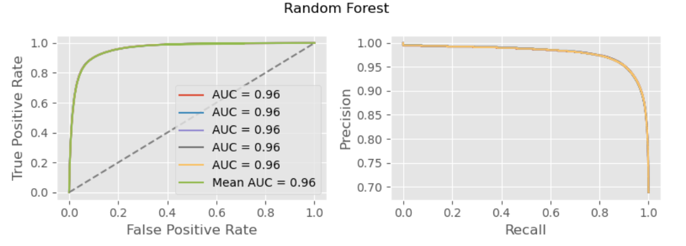

# Yelp DataSet

# Restaurant Classifier

## Goals / Business use case

The primary goal of this project is to develop a classifier which will predict a review category for tagging. The initial POC will be a binary -- restaurant / not-restaurant -- classifier, but this could be expanded trivially to include multiple classes in one classifier or multiple binary classifiers (e.g. predicting P(bar|resturant), etc.).

**Users** - Potential customers could be Yelp to aid in automatically tagging businesses using the input review text, thereby improving accuracy of platform reviews and increasing value to customers. Additionally, the review-writer could be the audience with tags being prompted to them after review creation for them to verify, similiar to AirBnb's feature tagging when writing reviews.

## Data collection

See (README.md)[README.md] for global data collection process.

## Data preparation / Tf-Idf

Using the data above, tagged every review as belonging to a restaurant or not and split the data into a train/test split with a 25% holdout.

I then fit a Tf-Idf matrix using scikit-learn's implementation. As part of this process, I not only tokenized the text data, but also excluded a customized list of stopwords adapted from the NLTK and scikit-learn libraries. Finally I passed the tokens through NLTK's WordNetLemmatizer to reduce inflectional forms and related wordings.

The initial TF-Idf featurizer was fit with 500 features, but this could be tuned in the future.

## Logistic regression

The first classifier fit was a logisitc regression, fit on the entire 75% training data set with `is_restaurant` as the target variable. Leveraging the `predict_proba` function, I fit an ROC curve of the training data showing an AUC of 0.97:

### Coefficients

An examination of the coefficients showed expected high values for clearly restaurant related words (e.g. food, pizza, etc.) and low values for clearly non-restaurant related words (e.g. salon, massage, etc.). This was expected and demonstrated the models ability to correctly classify food-related terms.

## Random forest

The next classifier fit was a random forest, fit simiarliy to the logistic regression model, above. However, given the size of the dataset and the increased training time, I selected 5 subsample sets of 100k reviews each and trained 5 seperate models, averaging their metrics for reporting. Each model materially agreed with the others, resulting in a mean AUC of 0.96:

### Feature importance

Examining the feature importance showed that the most frequent splits made a lot of sense given that they are words clearly associated with restaurants (e.g. food, restaurant, delicious, etc.). Including "restaurant" in here could be considered a form of data leakage, but given the use-case I believe it is appropriate to include it in the model

## Heteroscedasticity

As an aside, I wanted to understand both model's abilities to classify reviews of varying lenghts, with the hypothesis that longer reviews would be easier to classify. I did this by calculing the residuals against the reviews lenght in words, resulting in the following heteroscedasticity plots which materially confirmed my hypothesis:

## Use case testing

To further demonstrate a use clear use case I created 4 example reviews myself and tested them against both classifiers:
1) best burritos in town close to my house service is excellent
2) i hate this place its the worst service ive ever experienced i will never go back
3) i love buying my car parts here
4) ive been going to this dentist for 5 years and every time ive had a good experience

The classifiers performed fairly well on all 4 reviews, with the notable exception of the random forest classifier which misclassified review #1.

# Conclusions

Based on the above, it appears that the LogisticRegression classifier performs better than the RandomForest classifer with an AUC of 0.97 compared to 0.96. However, these are so close, that it could be noise. Both classifiers perform very well over random guessing.

## Choosing a prediction threshold

The next step in the process would be to select an appropriate threshold for classification taking into account the cost of a FP and FN. For example, we may determine that prompting a user to tag a review as "restaurant" when it is in fact a gas station, may lead to user churn and or dirty data. Therefor, in an effort to minimize FPs we may choose a prediction threshold with a higher Precision over Recall for the final deployment.

# Future development

There are many ways that this work could be taken further:
1) Developing a multi-class classifier (not just restaurants)
2) Performing K-fold tests on both models to be sure of the AUC
3) Tuning the hyperparameters
4) Training on a larger dataset (although this is unlikely to impact the model much)
5) Researching into the reviews that the model classified incorrectly
6) Adding other features to the models (zipcode, number of patrons, words in name, review_stars, various other attributes, etc.)
7) Featurzing with n-grams instead of only unigrams
8) Using different word embeddings (Word2Vec)