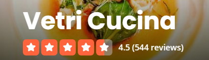
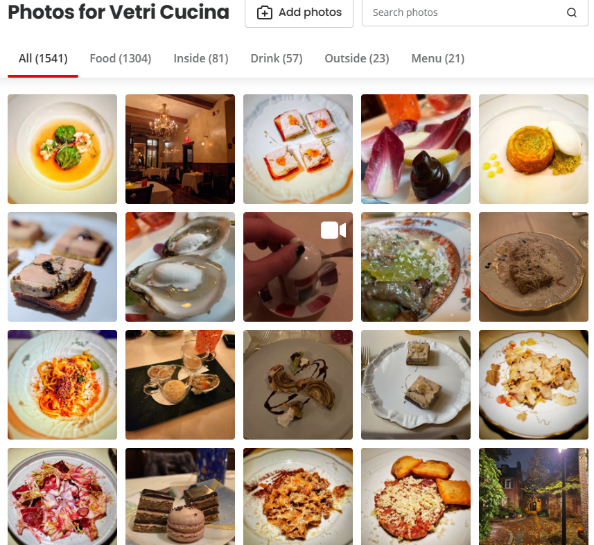
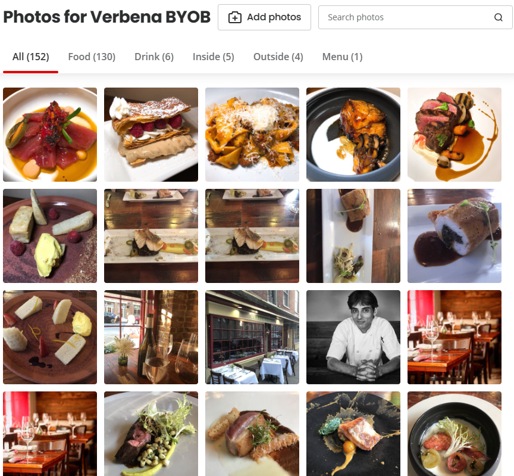
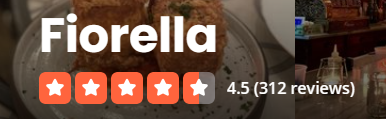
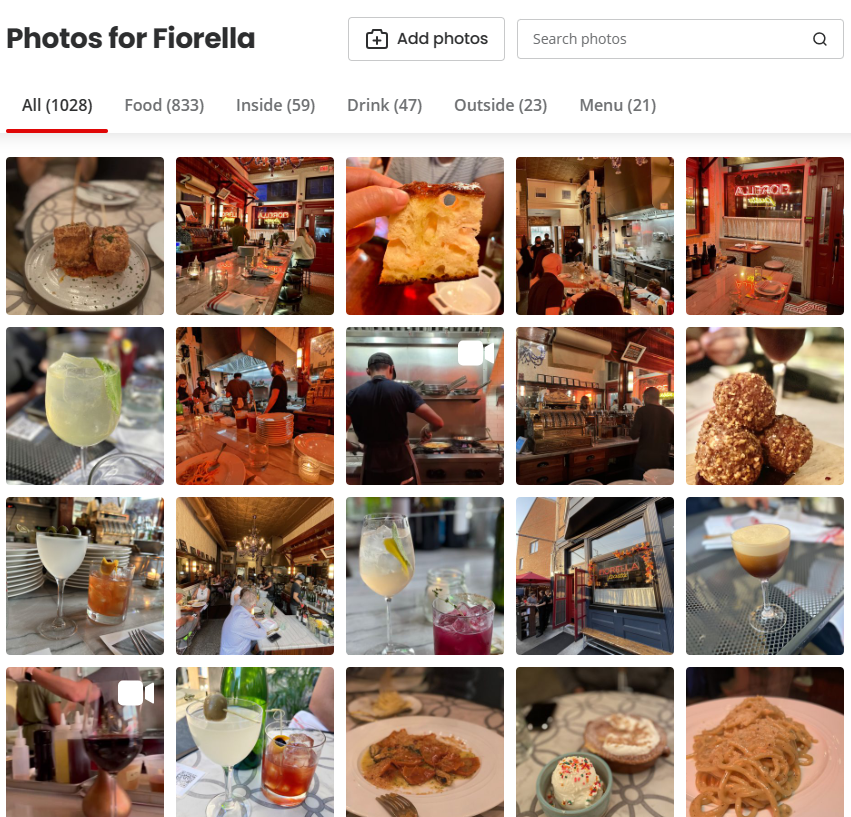

# Yelp DataSet

# Restaurant Recommender

## Goals / Business use case
The goal of this project is to generate a restaurant recommender systems for users. The initial approach is to use [NMF](https://en.wikipedia.org/wiki/Non-negative_matrix_factorization) to vectorize restaurants in a constrained feature space, with similar restaurants having similar vectors as measured by [cosine similarity](https://en.wikipedia.org/wiki/Cosine_similarity). This will be visualized through [UMAP](https://umap-learn.readthedocs.io/en/latest/). 

**Users** - The user of the product would be Yelp users. As they input a high review of a restaurant, the recommender would be able to provide recommendations for similar restaurants. This would increase the value for the user of the platform, thereby improving customer aquisition, usage, and retention.

A user's feeling about a given restaurant will be taken from either their star rating with the caveat that not all 5-star reviews are alike (e.g. I could rate something 5-stars, but not necessarily want to go to a similar place again for various reasons).

## Data collection

See (README.md)[README.md] for global data collection process.

## Data preparation / Tf-Idf

Using the data above, all review data will be aggregated into a single field for each restaurant with an initial df approximating the following:
| RestaurantId | RestaurantName | AllCombinedReviews |
| ------------ | -------------- | ------------------ |
| abcde...     | John's Place   | loved it was good, etc. | 

This data will then be featurized using Tf-Idf similar to the method outlined in [Classifer.md](Classifier.md).

## Model pipeline / implementation

From the aggregated data above I leveraged NMF to factor the Tf-Idf output into two matrices with 20 latent features based on the content of the reviews.

Using the H and W matrices from the NMF model, as well as the vocabulary from the Tf-Idf model, I analyzed the most common words and the highest ranking restaurants for each latent feature to ascertain an understanding of the model's ability to correctly interpret the text reviews. A number of clearly defined categories of restaurants were coming to the surface, a sample of which is below:  

In looking through the features, it appeared that most of the features have clear categories, capturing cuisine which makes sense as this is the most significant restaurant differentiator as opposed to service quality or location.

## Plotting / dimentionality reduction

I leveraged the `UMAP` library for dimensionality reduction as opposed to PCA as it was able to take into account non-linear relationships and has proven more adept at preserving the local structure of the underlying data. Generally, I was seeing a fairly good separation of restaurants with the selected number of latent features. There was some mixed up clustering in the middle which indicates that a different number of latent features could have captured the signal better.

## Calculating similarity / Evaulation

Returning to the use case, the goal of the project was to recommend similar restaurants to users based on their previous 5-star reviews. I leveraged the scikit-learn `cosine_similarity` function to generate the similarity score for all restaurants in the data set against every other restaurant based on their NMF latent feature embeddings. This resulted in a similarity matrix of num_restaurants X num_restaurants.

I then randomly sampled 5-star reviews from the data set and output the top restaurants with the closest similarity score that did not have the same name (in order to avoid a "I like Starbucks, therfore show me more Starbucks scenario).

As unsupervised learning models are difficult to evaluate, I relied on a manual review of the recommendations against readilty available online data. The result from one such review is below:

### Vetri Cucina 5-star review

[Yelp link](https://www.yelp.com/biz/vetri-cucina-philadelphia)

**Recommendation 1** : Verbena Byob

[Yelp link](https://www.yelp.com/biz/verbena-byob-kennett-square)

**Recommendation 2** : Fiorella

[Yelp link](https://www.yelp.com/biz/fiorella-philadelphia-2)

Based on a review of the Yelp data for the restaurants including photos of the food, interior, review of the menues, etc. The following key similarities were noted:
* Food generally looks similar
* Similar reviews
* Fine dining
* Price range
* Ambiance
* 2 are Italian

# Conclusions

Overall, this fairly simple recommender appears to do a pretty good job recommending similar restaurants based on a manual review of the latent features and the recommendations. Before making this user facing, I would want to do futher analysis to see how the rating distribution for a given user was materially different than the ratings that they may have actually given to some of the recommended restaurants. However, if that proves not to be feasible, another use case could be to use this recommender to try and generate more reviews by asking the user if they have been to any similiar restaurants and prompting them for reviews. 

# Future development
There are many ways that this work could be taken further:
1) Incorporating other non-text fields (e.g. ZipCode, lat/lon for business, etc.) to see if it improves the model.
2) Using the same features to provide the user more options (e.g. Only recommend restaurants within X kilometers from me).
3) Expanding the data set or use case to recommend outside of the set geo (e.g. If a user is traveling)
4) Tuning the number of latent features (see more info [here](https://radimrehurek.com/gensim/models/coherencemodel.html))
5) Featurzing with n-grams instead of only unigrams
6) Using different word embeddings (Word2Vec)